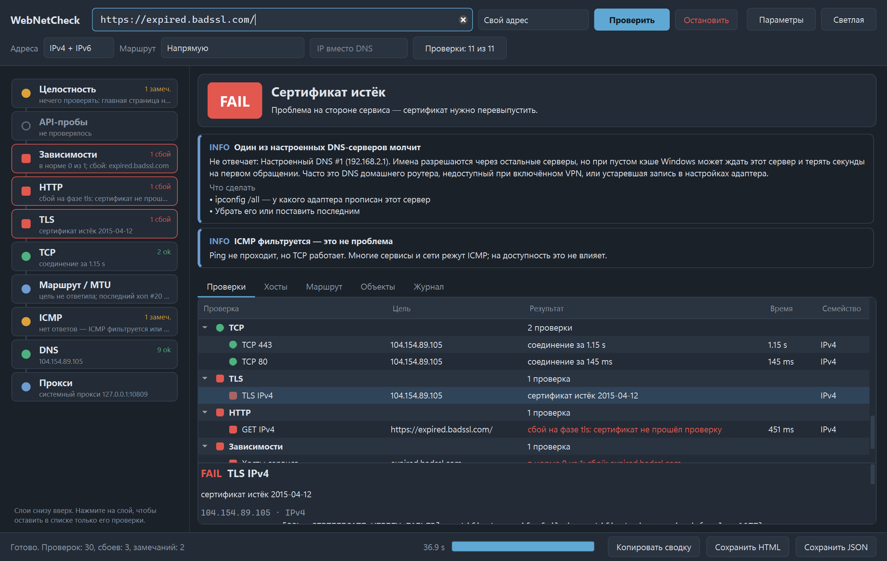

# WebNetCheck

[](https://github.com/salilov95/WebNetCheck/actions/workflows/tests.yml)
[](LICENSE)


Послойная диагностика доступности веб-ресурсов и API для Windows: от DNS до доставки контента. Инструмент показывает, на каком слое рвётся доступ, и предлагает, что делать дальше.

*Layer-by-layer reachability diagnostics for websites and APIs on Windows, with a GUI and a CLI. The interface is in Russian.*



## Зачем

Сайт может резолвиться в DNS, принимать TCP и проходить TLS-handshake, но оставаться нерабочим: CDN-хост не отвечает, передача замирает после 16 KiB, сертификат подменён инспекцией трафика. `ping` и «открылась главная» этого не показывают.

WebNetCheck проходит слои по порядку и выдаёт вывод вида «TCP проходит, TLS с настоящим именем рвётся, с нейтральным проходит — это фильтрация по SNI».

Проект вырос из идеи [nimbo78/web-netcheck](https://github.com/nimbo78/web-netcheck) — bash-утилиты под Linux. Здесь это отдельная реализация на Python под Windows: с окном, большим числом слоёв и разбором причины.

## Быстрый старт

### Готовый exe

1. Скачайте архив со страницы [Releases](https://github.com/salilov95/WebNetCheck/releases) и распакуйте.
2. Запустите `WebNetCheck.exe`. Python не нужен, права администратора не нужны.

Exe работает только вместе с соседней папкой `_internal`, поэтому переносите папку целиком.

### Из исходников

Нужен Python 3.11+ для Windows.

```
git clone https://github.com/salilov95/WebNetCheck.git
cd WebNetCheck
run.bat
```

`run.bat` при первом запуске создаёт `.venv`, ставит зависимости и открывает окно. Вручную то же самое:

```
python -m venv .venv
.venv\Scripts\pip install -r requirements.txt
.venv\Scripts\python app.py
```

## Что проверяется

| Слой | Как | Что ловит |
|---|---|---|
| Прокси | Реестр WinINET, PAC (`AutoConfigURL`), `netsh winhttp`, переменные окружения | Какой маршрут реально у системы; кандидаты PROXY из PAC |
| Внешний IP | Запрос к ipinfo.io, при отказе — ifconfig.co, затем ipify.org + RIPEstat; отдельно напрямую и через системный прокси | Под каким адресом и оператором (ASN) вы видны в интернете; расхождение выхода браузера (прокси/VPN) и прямого подключения |
| DNS | Системный резолвер, DNS из настроек адаптера, 8.8.8.8 / 1.1.1.1 / 77.88.8.8 по UDP/53, DoH Google и Cloudflare; A и AAAA | Сломанный корпоративный DNS, заглушки 0.0.0.0/127.x, split-horizon, закрытый UDP/53, внутренние имена |
| ICMP | Echo с потерями, avg, min/max, джиттером | Потери; ICMP закрыт, но TCP жив |
| Маршрут / MTU | Параллельный traceroute с обратными именами хопов; бинарный поиск Path MTU с DF (IPv4) | Где обрывается маршрут; туннели/PPPoE/VPN с MTU < 1500 |
| TCP | Подключение к портам по каждому адресу и семейству | RST (порт закрыт) против тишины (DROP на firewall) |
| TLS | Сертификат, цепочка, срок, SAN, версия, шифр, ALPN; отдельно «только TLS 1.2» и «только TLS 1.3»; при обрыве — повтор с нейтральным SNI | Фильтрация по SNI (DPI), поломка только TLS 1.3, перехват TLS (Kaspersky, UserGate, Ideco, Fortinet, Zscaler…), истекающие и чужие сертификаты |
| HTTP | Тайминги фаз (dns / tcp / tls / ttfb / body), код, редиректы, заголовки server/via/x-cache, Alt-Svc | 5xx (проблема сервиса, а не сети), 451, 403/407, анонс HTTP/3 |
| Зависимости | Хосты из профиля, из ресурсов страницы (`script/link/img/source/iframe/video`, без навигационных `<a>`), из `preconnect` и JSON-метаданных | «Главная открывается, а CDN/API — нет»; причина сгруппирована по слою |
| API-пробы | GET/POST из профиля, ожидание `2xx` / `non5xx` / конкретный код, ключи из переменных окружения | Маршрут до бэкенда жив/мёртв; ответ не тем кодом |
| Целостность | Крупнейшие объекты страницы (≥ 32 KiB): полная загрузка с детектором зависания, сверка с Content-Length, SHA-256, независимый Range-запрос хвоста | Обрыв или замирание после ~16 KiB, молчаливая обрезка, порча объекта по пути |

Режимы маршрута:
- напрямую;
- через системный прокси;
- через указанный прокси;
- сравнение «прокси и напрямую».

Режимы адресов: IPv4 + IPv6 (каждое семейство проверяется отдельно), только IPv4, только IPv6.

Поле **«IP вместо DNS»** работает как `curl --resolve`: проверяет конкретный узел CDN или балансировщика.

## Интерфейс

- **Слева — стек слоёв снизу вверх.** Слой со сбоем подсвечивается, во время проверки пульсирует текущий слой. Нажатие на слой фильтрует список проверок.
- **Сверху — вывод.** Главная причина и карточки с остальными выводами и шагами «что сделать».
- **Вкладки:**
  - «Проверки» — дерево проверок по слоям с подробностями;
  - «Хосты» — таблица с фазами. Двойной щелчок по хосту подставляет его в адрес;
  - «Маршрут» — хопы с полосами RTT;
  - «Объекты» — загрузка с прогрессом;
  - «Журнал».
- **Экспорт:** HTML-отчёт (тёмная и светлая тема, удобно переслать коллеге), JSON и «Копировать сводку» для тикета или мессенджера.
- **Клавиши:** Enter или Ctrl+R — запуск. Настройки и последний адрес запоминаются.

## Профили

Профили лежат в `profiles\*.toml`. Встроенные: `github`, `ya`, `zai`. Шаблон — `profiles\_example.toml`: скопируйте его в `myservice.toml` и поправьте.

Порядок поиска:
1. `%WEBNETCHECK_PROFILES%`;
2. `profiles\` рядом с exe;
3. встроенные.

Внутри профиля можно подставлять переменные окружения: `${ZAI_API_KEY}` и `${VAR:-значение по умолчанию}`. Секретные заголовки в отчёте маскируются.

## Консольный режим

```
python cli.py github
python cli.py https://example.com --family v4 --html report.html
python cli.py example.com --route manual --proxy 10.0.0.1:3128
python cli.py cdn.example.com --ip 203.0.113.10 --only dns,tcp,tls,http
python cli.py --list-profiles
python cli.py --myip
```

Вывод заканчивается строками `RESULT <слой>=OK|WARN|FAIL` и `RESULT overall=…`. Коды выхода:
- `0` — сбоев нет;
- `1` — есть сбой;
- `2` — неверные аргументы.

Подходит для Планировщика заданий.

## Как читать статусы

- **FAIL** — слой не работает.
- **WARN** — работает с оговоркой: замечания, необязательные сторонние хосты, ICMP без ответа.
- **INFO** — факт без оценки.
- **SKIP** — не проверялось.

Сбой прямого подключения при работе через прокси считается фактом (INFO), а не ошибкой.

## Сборка exe

```
build_exe.bat
```

Скрипт ставит PyInstaller в `.venv` и собирает две папки:

- `dist\WebNetCheck\WebNetCheck.exe` — окно;
- `dist\webnetcheck-cli\webnetcheck-cli.exe` — консоль.

Перед сборкой закройте окно программы: открытый exe блокирует свои файлы, и скрипт остановится с `BUILD FAILED`.

`rebuild_and_test.bat` делает полный цикл: тесты, сборка, прогон обоих exe. Результаты пишутся в `_verify\`.

Релизы собирает GitHub Actions: при пуше тега `v*` workflow `release` собирает оба exe на Windows и прикладывает архивы к релизу.

## Тесты

```
python -m unittest discover -s tests
```

28 тестов логики: поиск Path MTU, traceroute, анализ DNS, правила диагноза, разбор ресурсов страницы, настройки прокси. Сеть и Qt для них не нужны.

## Структура

```
app.py              запуск окна
cli.py              консольный режим
netcheck/           движок без зависимости от Qt
  engine.py         порядок слоёв, события для окна и консоли
  dnscheck.py       DNS: система, адаптеры, публичные, DoH
  icmp.py           ping, traceroute, Path MTU через iphlpapi.dll
  transport.py      TCP, CONNECT через прокси, TLS, сертификаты
  httpclient.py     HTTP с таймингами фаз и детектором зависания
  discovery.py      ресурсы страницы
  diagnosis.py      правила: из результатов проверок в вывод
  report.py         экспорт HTML и JSON
gui/                окно на PySide6
profiles/           профили сервисов в TOML
tests/              юнит-тесты логики
```

## Что проверено и ограничения

Проверено на Windows 11 (Python 3.14, PySide6 6.11): сборка exe, работа окна, ICMP через `iphlpapi.dll` (ping, traceroute на 21 хоп, Path MTU), чтение системного прокси, профили `github` и `ya`. Сценарии сбоев проверены на локальном HTTPS-стенде: обрыв на 16 KiB, зависание передачи, сервер без Range, чужой сертификат, фильтрация по SNI, 5xx.

Не проверено: IPv6-ветка ICMP, PAC-файлы, Windows 10, остановка по клавише Esc.

Ограничения:

- PAC-скрипт не исполняется. Берётся первый `PROXY` из файла, а ручной прокси можно указать явно.
- HTTP/3 (QUIC) не проверяется — только факт анонса.
- Path MTU ищется только для IPv4.
- Интерфейс только на русском.
- Внешний IP определяется запросом к сторонним сервисам. Отключается в меню «Проверки» или `--skip extip`.

Если окно упадёт, стек попадёт в `%LOCALAPPDATA%\WebNetCheck\crash.log`.

## Участие

Правки и новые профили приветствуются: см. [CONTRIBUTING.md](CONTRIBUTING.md). История изменений — в [CHANGELOG.md](CHANGELOG.md).

## Благодарности

- [nimbo78/web-netcheck](https://github.com/nimbo78/web-netcheck) — исходная идея и списки хостов встроенных профилей.

## Лицензия

[MIT](LICENSE). Лицензии зависимостей и оригинального проекта — в [THIRD_PARTY_NOTICES.md](THIRD_PARTY_NOTICES.md).
